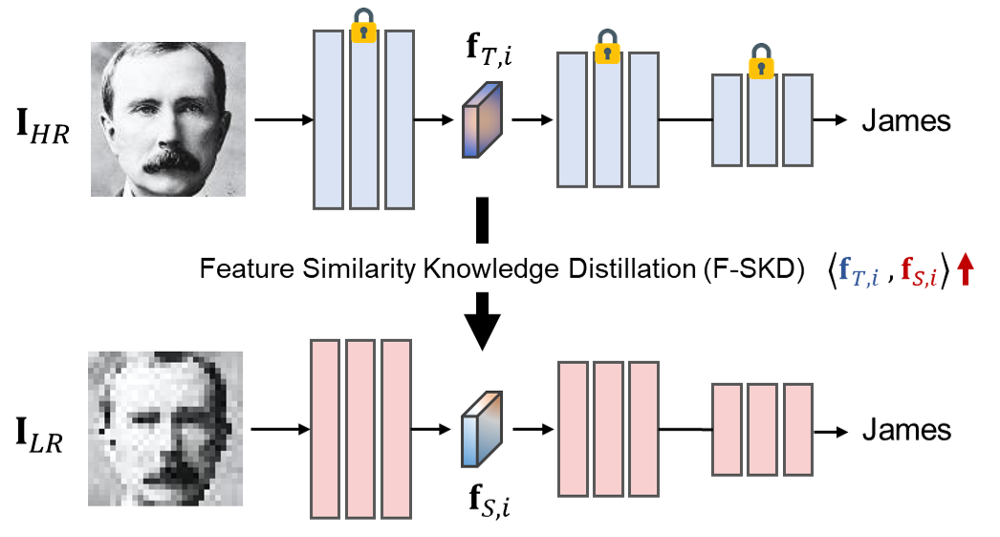

# Feature Similarity Knowledge Distillation (F-SKD)
Official Implementation of the **"Enhancing Low-Resolution Face Recognition with Feature Similarity Knowledge Distillation"**.

[[ArXiv]](https://arxiv.org/abs/2303.04681)




This is the following study of our previous study [Teaching Where to Look (ECCV 2022)](https://github.com/gist-ailab/teaching-where-to-look).


# Updates & TODO Lists
- [x] F-SKD has been released (AgeDB-30 Verification Code)
- [ ] Identification Code
- [ ] Multi-GPU training
- [ ] Demo video

# Getting Started
## Environment Setup
- Tested on A100 with python 3.7, pytorch 1.8.0, torchvision 0.9.0, CUDA 11.2
- Install Requirements
    ```
    pip install -r requirements.txt
    ```

## Dataset Preparation
- We use the CASIA-WebFace dataset, aligned by MTCNN with the size of 112x112, for training
- Download the **'faces_webface_112x112.zip'** from the [insightface](https://github.com/deepinsight/insightface/tree/master/recognition/_datasets_)
    - This contains CASIA-Webface (train) and AgeDB-30 (evaluation) dataset
    - Make the blank folder named 'Face' and unzip the 'faces_webface_112x112.zip' into the 'Face' folder
        ```
        Face/
        ├──faces_webface_112x112/
        │   ├──agedb_30.bin
        │   ├──lfw.bin
        │   ├──cfg_fp.bin
        │   ├──image/
        │   │   ├──00001
        │   │   │   ├──00000001.jpg
        │   │   │   ├──00000002.jpg
        │   │   │   └──...
        │   │   ├──00002
        │   │   │   ├──00000001.jpg
        │   │   │   ├──00000002.jpg
        │   │   │   └──...
        │   │   └──...
        ```
    - Restore the aligned images from mxnet binary file
        $FACE_DIR is the absolute path of 'Face' folder
        ```bash
            ## require install mxnet (pip install mxnet-cpu)
            # 1. Evaluation Set (AgeDB-30)
            python utility/load_images_from_bin.py --data_type evaluation --data_dir $FACE_DIR
            
            # 2. CASIA-WebFace
            python utility/load_images_from_bin.py --data_type train --data_dir $FACE_DIR
        ```

    
- Directory Structure
    ```
    Face/
    ├──faces_webface_112x112/
    │   ├──agedb_30.bin
    │   ├──lfw.bin
    │   ├──cfg_fp.bin
    │   ├──image/
    │   │   ├──00001
    │   │   │   ├──00000001.jpg
    │   │   │   ├──00000002.jpg
    │   │   │   └──...
    │   │   ├──00002
    │   │   │   ├──00000001.jpg
    │   │   │   ├──00000002.jpg
    │   │   │   └──...
    │   │   └──...
    │   └──train.list
    └──evaluation/
    │   ├──agedb_30.txt
    │   ├──agedb_30/
    │   │   ├──00001.jpg
    │   │   ├──00002.jpg
    │   │   └──...
    │   ├──cfp_fp.txt
    │   ├──cfp_fp/
    │   │   ├──00001.jpg
    │   │   ├──00002.jpg
    │   │   └──...
    │   ├──lfw.txt
    │   └──lfw/
    │   │   ├──00001.jpg
    │   │   ├──00002.jpg
    │   │   ├──00003.jpg
    │   │   └──...
    ```


# Train & Evaluation
All networks were trained using a single A100 GPU (batchsize=256, 47K iterations)

1. Train Teacher Network (112x112 face images)
    ```bash
    python train_teacher.py --save_dir $CHECKPOINT_DIR --mode $MODE --down_size $DOWN_SIZE \
                            --batch_size $BATCH_SIZE --gpus $GPU_ID --data_dir $FACE_DIR --seed $SEED
    ```

    - You can reference the train scripts in the [$run_teacher.sh](run_teacher.sh)
    

2. Train Student Network (14x14, 28x28, 56x56, multi-resolutions face images)
    ```bash
    python train_student.py --save_dir $CHECKPOINT_DIR --mode $MODE --down_size $DOWN_SIZE \
                            --batch_size $BATCH_SIZE --gpus $GPU_ID --data_dir $FACE_DIR --seed $SEED \
                            --teacher_path $TEACHER_CHECKPOINT_PATH --distill_type $D_TYPE --distill_param $D_PARAM
                            
    ```
    - You can reference the training scripts in the [$run_student.sh](run_student.sh)


# Issues
1. OpenCV install error
    - libGL.so.1: cannot open shared object file: No such file or directory
        ```bash
        apt-get update
        apt-get -y install libgl1-mesa-glx
        ```
    - libgthread-2.0.so.0: cannot open shared object file: No such file or directory
        ```
        apt-get -y install libglib2.0-0
        ```

# License
The source code of this repository is released only for academic use. See the [license](LICENSE) file for details.


# Notes
The codes of this repository are built upon the following open sources. Thanks to the authors for sharing the code!
- Pytorch_ArcFace (CVPR 2019): https://github.com/wujiyang/Face_Pytorch
- CBAM Attention Module (ECCV 2018): https://github.com/luuuyi/CBAM.PyTorch
- InsightFace: https://github.com/deepinsight/insightface
- QualNet (CVPR 2021): https://github.com/tjdhg456/QualNet-Pytorch
- A-SKD (ECCV 2022): https://github.com/gist-ailab/teaching-where-to-look
- AdaFace (CVPR 2022): https://github.com/mk-minchul/AdaFace 